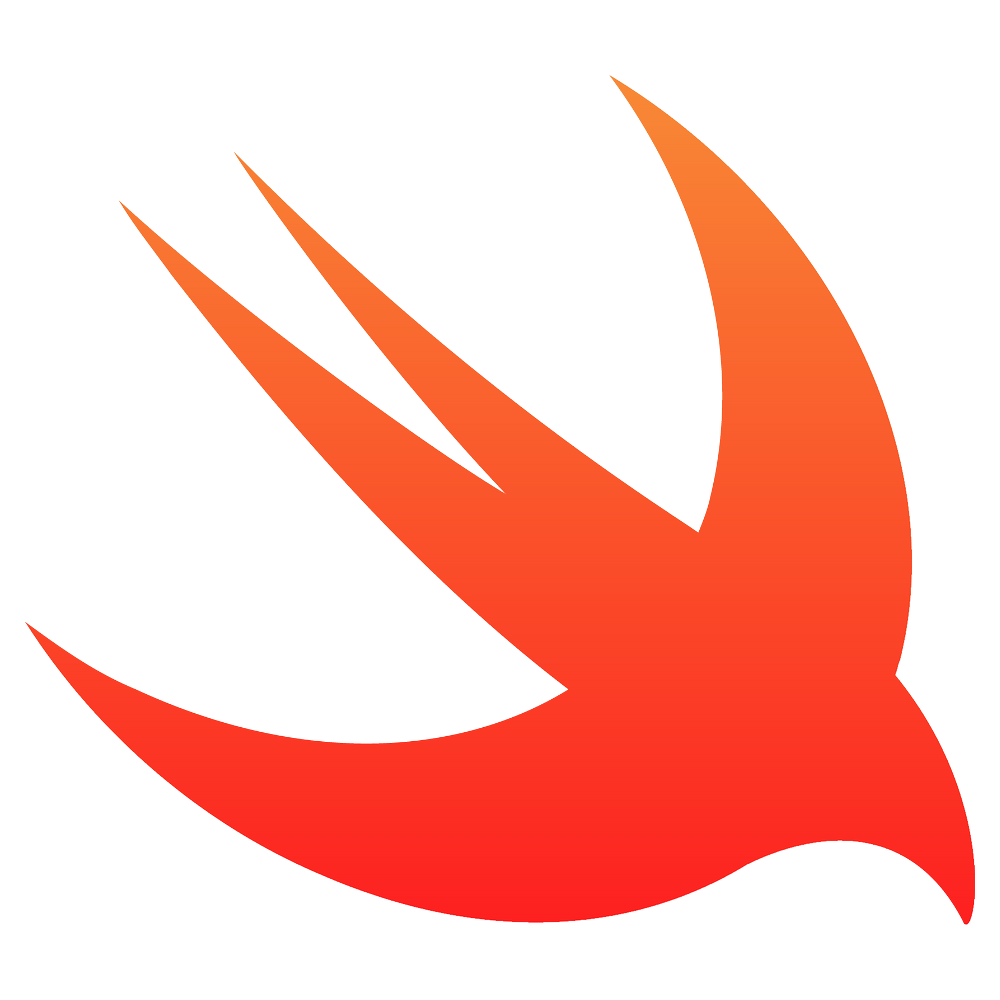
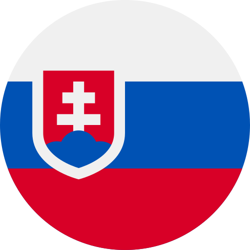

  

<h1 align="center">Roman Holova iOS Developer 👨‍💻 </h1>

## ABOUT: 
Motivated and detail-oriented iOS Developer with 1+ year of hands-on experience of developing, deploying robust native iOS applications using Swift. UIKit/SwiftUI. Skilled in creating intuitive user interfaces, integrating RESTful APIs, and optimizing performance for seamless user experiences. Experienced in working with CoreData, additional frameworks, and multithreading techniques (GCD, OperationQueue, async/await) to build efficient, scalable apps. Strong understanding of software design principles (MVC, MVVM), version control systems (Git), and the iOS Human Interface Guidelines. Proven ability to collaborate effectively in agile teams, rapidly adapt to new technologies, and deliver high-quality, maintainable code. 
## EXPERIANCE: 💼 
**FRELANCE(SELF-EMPLOYED): SEP 2023 – PRESENT** 
- At this time, I have worked mostly on my own projects and freelance projects. It was not a full-time job, but I gained a lot of knowledge and skills. I was lucky to work with such technologies: UIKit/SwiftUI, Alamofire, Firebase, Google maps API, Custom services API, etc. - From July 2024 - I have worked on my own pet application "CoctailsApp" under mentorship of Primoz Cuvan - Mobile Team Lead at nyra health GmbH / iOS developer.

**Technologies**: `SwiftUI / UIKit`, `async / await`, `MVC/MVVM`, `Firebase` , `Alamofire`, `SwiftPM`, `GCD`, `CoreData/SwiftData`, `API/JSON`.

💼 &nbsp;**HOMECLINICO(PART-TIME JOB): JUL 2024 – PRESENT**
I was added to team of a MindfulMotion app - a versatile app that combines cognitive challenges with motor skills development (wrist, elbow, and the whole arm). I am working on this app with Aleksandar Milidrag (iOS Developer) and with/under mentor/lead Primoz Cuvan - Mobile Team Lead at nyra health GmbH / iOS Developer, using git source control and Jira project tracking software.
My achievements:
 --  added various solutions to UI(merging two views, added and configured custom alert view etc.)
 --  added and configured remote persistance and auth service (firebase / supabase)
 --  remote persistence and auth service moved to a separate packages
 
**Technologies**: `SwiftUI / UIKit`, `async / await`, `MVVM`, `Firebase`, `Supabase`, `SwiftPM`

-  &nbsp;Live in Slovakia

  
🔽 &nbsp;<strong>Details</strong>

- 👔 &nbsp;Organized & standalone
- 🤓 &nbsp;Love to code
- 🌱 &nbsp;Constantly learning
- 📐 &nbsp;Prone to perfectionism
- 🎓 &nbsp;Higher educations

&nbsp;

## Skills

- 🛠 &nbsp;**Main stack** is `Swift` , `SwiftUI` , `UIKit`, `xCode` , `CoreData`, `URLSession`, `Alamofire`, `Realm`, `Firebase`, `MVC`, `MVVM`, `Auto Layout`, `Git`, `XCTest`
- **Other**: `Slack`, `Jira`, `API/JSON`, `Git`, `SwiftPM/Packages`,  `REST APIs,` `CocoaPods`

  
🔽 &nbsp;<strong>Details</strong>

- 🧠 &nbsp;Choose a simple way to solve the problem
- 🧩 &nbsp;Use a patterns & techniques
- 🔧 &nbsp;Use modern frameworks, libraries, and tools
- 📱 &nbsp;Implement responsive interface 
- 🧹 &nbsp;Follow a consistent code style

&nbsp;

## [Contact](https://michaelany.com/#/contact)

Do you need to **contact me**? Have a **suggestion** for me? Send a mail to romanholovai@gmail.com or use links below:

